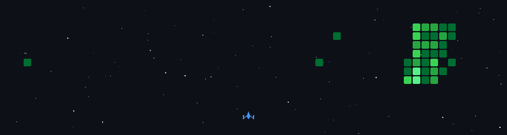

<div align="center">

[](https://github.com/eobarretooo)

</div>

---

```yaml
name: Renan Barreto
handle: eobarretooo
focus: local-first AI assistants
stack: [Python, FastAPI, SQLite, Linux, Termux]
building: ClawLite — self-hosted AI with memory, channels & 24/7 autonomy
status: actively developing
```

---

<div align="center">

[](https://github.com/eobarretooo/ClawLite)
[](https://discord.gg/F4wQvdv9fR)
[](https://www.threads.net/@eo_barretooo)

</div>

---

<div align="center">

[](https://github.com/eobarretooo)

</div>



